# Udacity Project 2: Building a CI/CD Pipeline

[](https://github.com/nghiattr/udacity-devops-project2/actions/workflows/pylint.yml)


## Overview and Architectural Diagram

The purpose of this project is to build and deploy a Flask Webapp using various tools such as GitHub, GitHub Actions, Azure ADO, and Azure Pipeline.

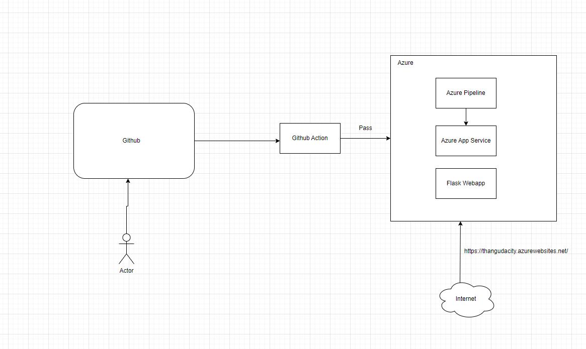

## Running the Python Flask Project

1. Create a virtual environment using Python:
```bash
python3 -m venv flask-ml-azure
source flask-ml-azure/bin/activate
```

2. Install dependencies from the `requirements.txt` file:
```bash
make install
```

3.1 Start the web application locally:
```bash
python3 app.py
```

3.2 Create an Azure Web App service in Azure Cloud Shell (Note: replace "< yourappname >" before executing):
```bash
./commands.sh
```

4.1 In a separate shell, run: `./make_prediction.sh`

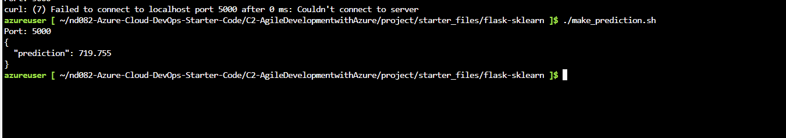

4.2 In a separate shell, run: `./make_predict_azure_app.sh` (Note: replace "< yourappname >" before executing).

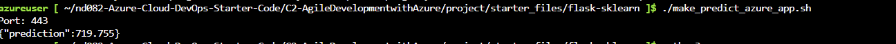

## Github-action

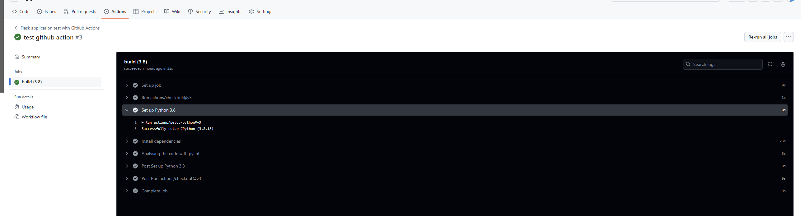

## Step by step to create a CICD pipline

1. Create an Azure DevOps Organization:

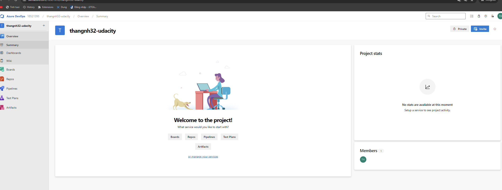

2. Import the GitHub repository to create a Git repository:

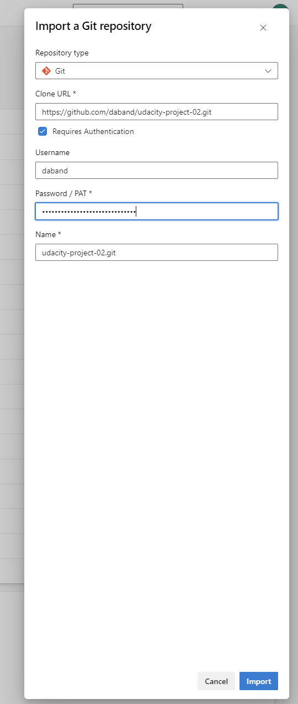

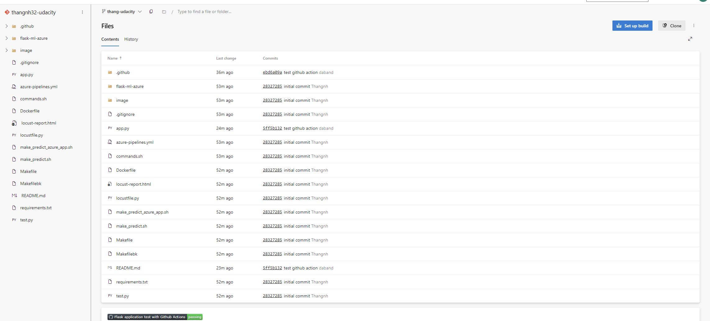


3. Set up Agent pools and Agent VMs for Azure Pipeline:


Create an access token for agents to connect to the pools.


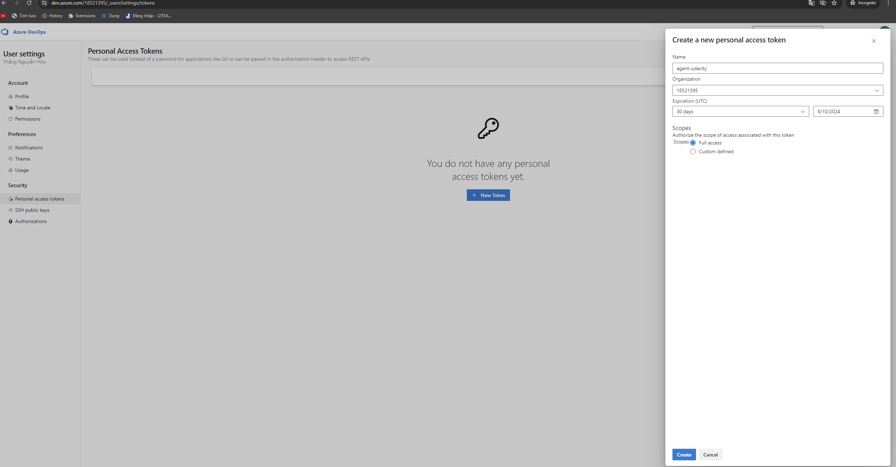


Create pools.


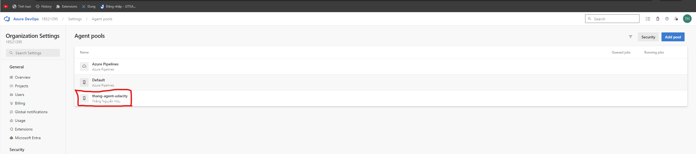


Create and setting up agents


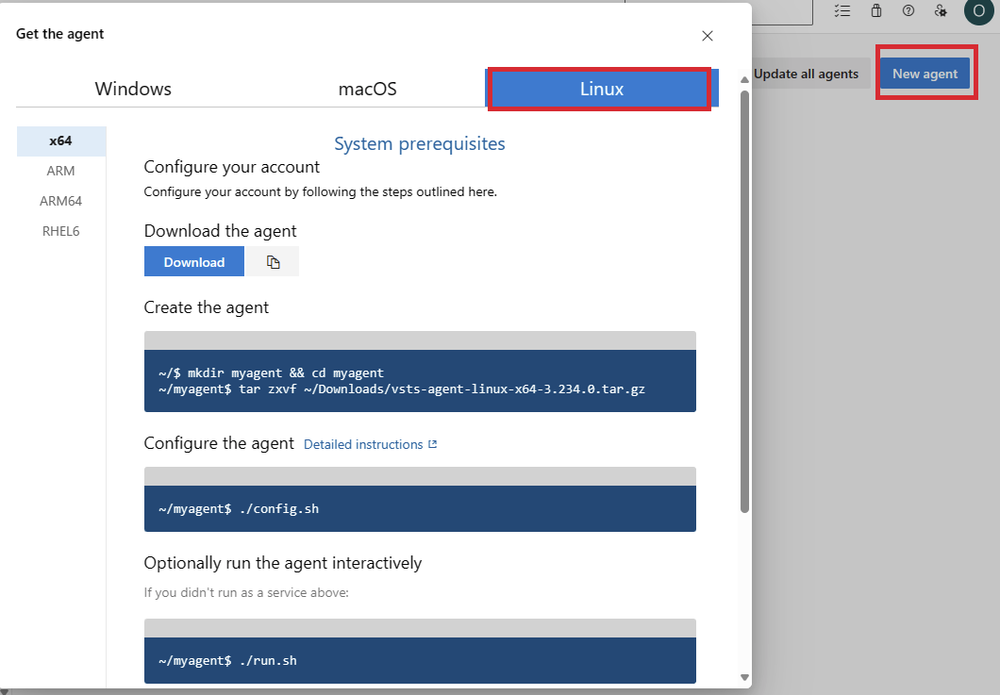


4. Create Service connections:


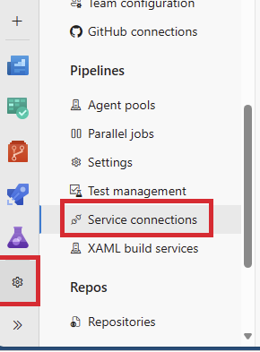


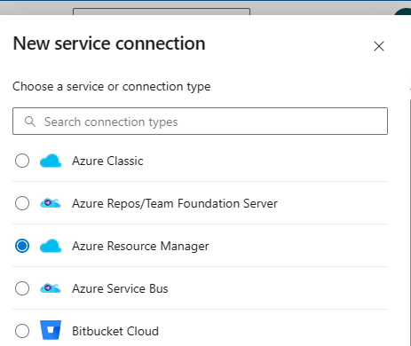


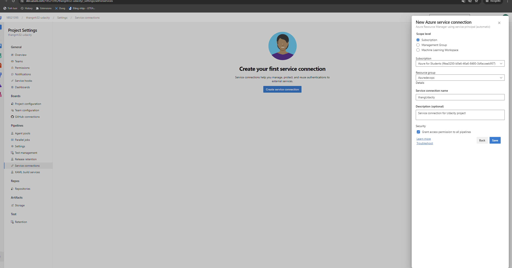


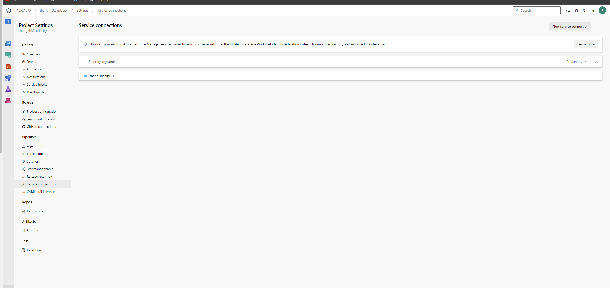


5. Set up an Azure Pipeline:


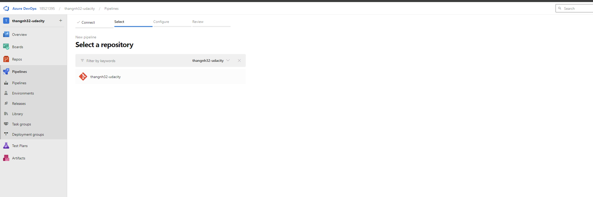


6. Trigger the pipeline to build & deploy the Flask application to Azure Web App Service:


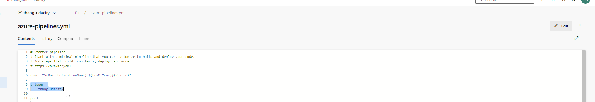


Check the result:


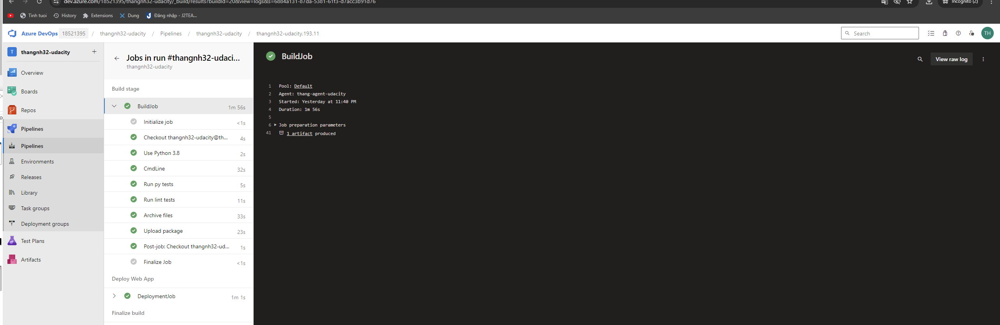


For more details, please refer to the video links in the "Demo Links" section.


## Link to the Trello Board


[Trello Board Link](https://trello.com/b/cdHEK4Qv/thangnh32-udacity)

| Task Description                                           | Quarter | Week | Estimated Time (hours) | Actual Time (hours) |
|------------------------------------------------------------|---------|------|------------------------|----------------------|
| Set Up GitHub Repository                                   | Q1      | 1    | 8                     | 8                     |
| Initial Codebase Setup                                     | Q1      | 2    | 8                      | 8                     |
| Implement the code feature for project (Application code)  | Q1      | 3    | 10                     |  8                    |
| Implement Continuous Integration with Azure Cloud Shell    | Q1      | 4    | 12                     | 8                     |
| Implement Continuous Delivery with Azure Pipelines         | Q1      | 6    | 10                     |  8                   |
| Load Testing using Locust                                  | Q1      | 7    | 10                     | 8                     |
| Deploying app to Server (App Service) - Dev environment    | Q2      | 9    | 8                      |  8                    |
| Setting up UAT plan and planning deploy to Prod environment| Q3      | 10   | 6                      |   8                   |
| Documentation of the project                               | Q3      | 12   | 8                      | 8                     |


## Continuous Integration


A screenshot demonstrating the project cloned into Azure Cloud Shell:
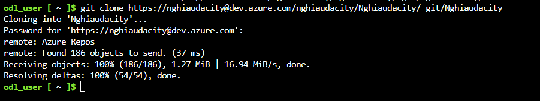


A screenshot showing the passing tests displayed after running the make all command from the Makefile, along with the output of a test run:
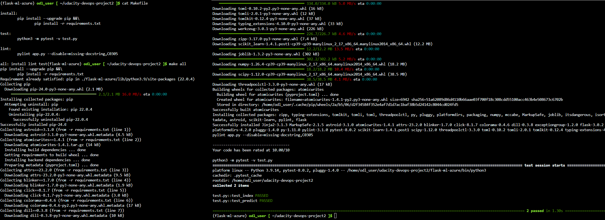


## Continuous Delivery


To run Locust:
```bash
locust -f locustfile.py
```

Result:


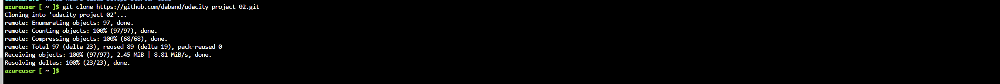

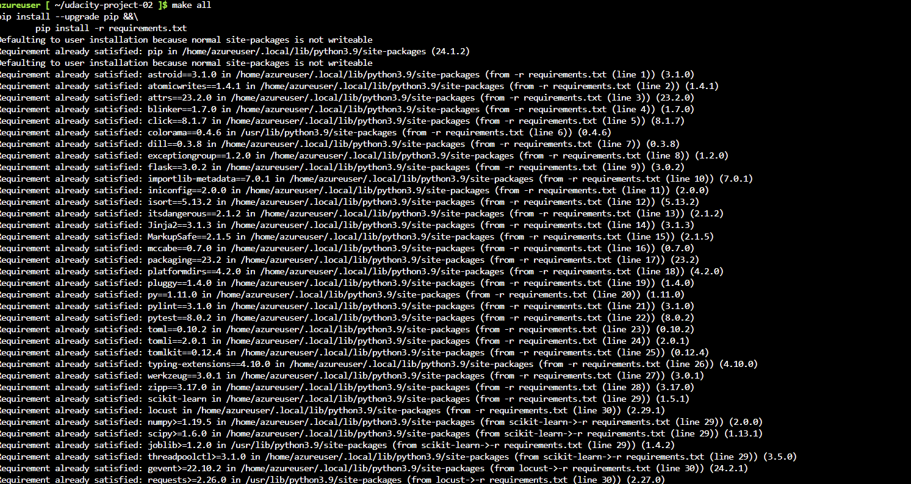

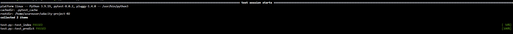


And the report: `locust-report.html`


## Demo Links:


[Github Action](https://youtu.be/FIfIcomB-Ak)


[CICD](https://youtu.be/NnCFK7AULq0)

